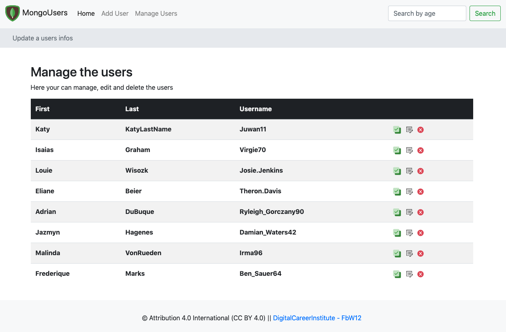

# UsersDb

A web-application with Node, Mongodb, Mongoose, Express, Handlebars & Bootstrap 

Live demo available on [Zeit](https://dbuser.leandro-berlin.now.sh)

## Setup & run

- Clone the repo
- You need a running instance of MongoDB
- `npm i`
- `npm run dev`

When you run the application for the first time it will seed the database with 10 random users created with [Faker](https://github.com/marak/Faker.js/)

## Npm Scripts

- `npm run dev` uses nodemon
- `npm start` uses node

## Features
- Database seeding
- Express with Handlebars/Bootstrap
- Users overview
- Single user infos
- Search by age greater than
- Insert & Modify users
- Delete user
- Zeit Now deployment configuration

## Deployment on Zeit
In order to deploy your app on ['Zeit Now'](https://zeit.co) you need to create a database reachable from the Internet first. 
You can use the free service of [Mongo Atlas](https://www.mongodb.com/cloud/atlas). You'll also need to edit the mongose.connect() method in `controller/database` to use your Mongo Atlas credentials.

## To Do
- Authentication (JWT)
